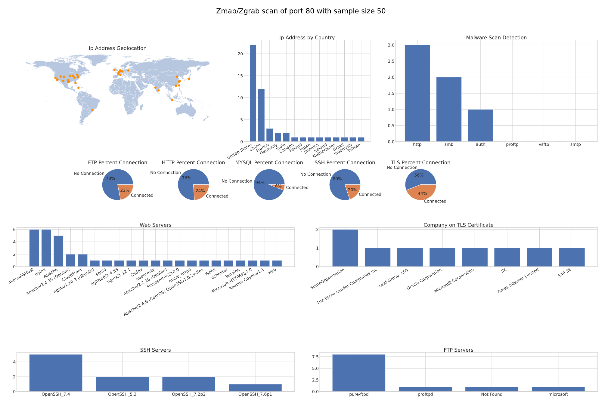

# Zmap Reporter

https://github.com/dmruss/ZmapReporter

## Program Description

Zmap Reporter is a wrapper for the Zmap, Zgrab, and Nmap which gives cyber security professionals quick access to usable and understable data from whole internet security scans.  This tool adds several functions on top of the existing functionality of Zmap:
 
 - Built in Zmap integration with Zgrab, the banner grabbing utility
 - Automation of various scans and banner grabs with Zgrab
 - Add geolocation information to dataset
 - Banner parsing and dataset generation 
 - Integration with Nmap for malware detection scanning
 - Plotting and report generation

Required: This program currently only runs on Unix based operating systems and was designed specifically for use with Kali Linux.

DISCLAIMER: This program does do potentially invasive scans of remote devices.  Use your best judgement when performing network discovery and malware detection scans.  This project takes no responsiblity for your use of the program.  This program is for research and defensive purposes only.

Here is an example scan report:


This program is wrapper for Zmap, Zgrab, and Nmap for creating datasets and generating plots for whole internet security scans and its steps are as follows.  Once the user enters input parameters for port, sample, and scan size this initiates a scan by Zmap.  Zmap unusually fast at doing network discovery scans like this and with the proper internet bandwidth can scan the entire IPv4 space in under an hour.  It was chosen as the network discovery portion of this program for that purpose.  

After Zmap discovers a list of IPv4 addresses which are currently open on the selected port, that list is input into various Zgrab banner grab scans.  These scans are modules in the Zgrab program.  Each modules run a different scan to detect different services running on an ip address.  This program runs scans looking for services including:
 - SSH servers 
 - HTTP servers
 - FTP servers 
 - TLS servers 
 - MySql servers  
 The banners from these scans are grabbed and saved as json files.

The json files output by Zgrab are then parsed by new code specific to Zmap Reporter.  This parsing is based on previously identified useful fields that can help users better understand a network.  Some of these fields include TLS certificate owner, http server sofware, SSH server software, FTP server software, and http redirects.  After parsing, each ip address has its geolocation queried to generate a geographic dataframe.  All parsed data is output as usable csv datasets.

Next, a subset of ip addresses are scanned for malware.  This is done using Nmap's script engine.  The Nmap script engine contains many different categories of scripts which can be run against agents during a scan.  A select subset of scripts from the malware category are chosen to be run against a subset of ip addresses. The malware scans include:
 - Scan for spoofed replies - Checking if an auth server will respond before a query is completed.
 - ProFTP backdoor exploit scan  -  Checks for an open backdoor in the ProFTPD server software using the ```id``` command.
 - VsFTP backdoor exploit scan  -  Checks for an open backdoor in the vsFTPD server software using the ```id``` command.
 - Zombie server scan  -  Checks if a webserver has been converted to a zombie botnet.
 - SMTP unexpected port scan  -  Checks if an SMTP mail server is running on a port besides 21, which may indicate someone has compromised the machine.
 - SMB Double Pulsar backdoor scan  -  Checks if a machine has been compromised by the DoublePulsar backdoor implant developed by the NSA.
 The subset of ip addresses are chosen based on criteria from the parsed banners. For instance, for the Zombie server scan, machines with open port 80 are chosen as they are more likely to be a web server.  FTP based scans are only completed on ip addresses identified as having an FTP server running on an open port.  
 
 The Nmap scans generate txt file outputs which are saved to the temp folder.  These text files are then parsed by the Zmap Reporter parser and dataframes are generated based and saved to the nmapscans output folder.

 Finally, the plotting function reads in the datasets output by the parser.  The plotting function then creates plots using the Matplotlib and geoPandas library.  These plots are then output as a pdf report in the output folder.

## Setup

To setup Zmap Reporter, download and unzip this repository to a location where you have read/write priviledges.  From the root directory of the local repository run the setup.sh script.  This will guide your system through setting up dependecies for the program including: Zmap, Zgrab2, Nmap, Python, and several Python dependecies.

## Usage

To use the program, from the root directory of the project run 
```python3 zmapReporter.py``` command.  This will open a menu in the terminal window which will guide you through selecting parameters for scanning.  The menu options are:

(r) - This will request parameters to begin a scan.  Required parameters are 
      the port number, the sample size of IP addresses to locate, and the scan 
      size.  The scan size is the number of IP addresses to perform malware 
      script  scanning on.  This number is limited due to the high network cost 
      of perfroming malware scans.  Small scans are 1/5 the sample size, medium 
      scans are 1/3 the sample size, and large scans are 1/2 the sample size.

    Parameter range:
        ports - Integer 1 - 65535.
        samples - Integer 2 - 500.
        scan size - Integer 1 - 3 

(h) - The help menu.

(e) - Exit the program.

The tool will output to the command line as the program is run.  It will return to the main menu upon completion.  

### Outputs

All outputs generated during a scan will be found in the 'output' folder in the root directory.  Each scan will be contained in a separte directory titled by [year][month][day]-[time][port]

Within that scan directory, the report will be saved in the 'final_output' directory, the banner datasets will be in the 'banners' directory, and the malware scans will be in the 'nmapscans' directory.

An example output can be seen in the exampleOutput directory.
The example below shows the output for a scan of port 80 on May 3, 2022 at 5:20 pm.

        Root
        ├── docs
        ├── LICENSE
        ├── output
        │   └── 20220503-1720-80
        │       ├── banners   <-------------banner based datasets
        │       │   ├── ftp.csv
        │       │   ├── geo.csv
        │       │   ├── http.csv
        │       │   ├── mysql.csv
        │       │   ├── ssh.csv
        │       │   └── tls.csv
        │       ├── final_output <----------contains report pdf output
        │       ├── nmapscans <-------------malware scan datasets
        │       └── temp
        │           ├── banners
        │           │   ├── ftp.json
        │           │   ├── http.json
        │           │   ├── mysql.json
        │           │   ├── smtp.json
        │           │   ├── ssh.json
        │           │   └── tls.json
        │           ├── ipaddresses.csv <---list of ip addresses discovered 
        │           └── nmapscans
        │               └── http.txt
        ├── README.md
        ├── requirements.txt
        ├── setup.sh
        ├── src
        ├── tests
        └── zmapReporter.py

## Examples

There are example screenshots of the program in the Screenshots.pdf file under the docs directory.
Below is an example of a scan for 5 addresses with port 80 open.  The user selects a 'small' scan meaning that 1 address will be scanned for malware.
```
>python3 zmapReporter.py

###############################################
Welcome to ZmapReporter, please make a selection 
from the available options in the main menu and press enter.

Main Menu
Run Reporter (r)
Help (h)
Exit (e)
Selection: >r

Input Port Number between 0 and 65535 
or (-1) to return to main menu: >80

Input Sample Size less than 500 
or (-1) to return to main menu: >5

Input Scan Size Small (1), Medium (2), or Large (3) 
or (-1) to return to main menu: >1

May 03 15:45:16.849 [INFO] zmap: output module: csv
 0:00 0%; send: 0 0 p/s (0 p/s avg); recv: 0 0 p/s (0 p/s avg); drops: 0 p/s (0 p/s avg); hitrate: 0.00%
 0:01 0%; send: 80263 80.1 Kp/s (77.5 Kp/s avg); recv: 0 0 p/s (0 p/s avg); drops: 0 p/s (0 p/s avg); hitrate: 0.00%
 0:02 0%; send: 136710 56.4 Kp/s (67.2 Kp/s avg); recv: 0 0 p/s (0 p/s avg); drops: 0 p/s (0 p/s avg); hitrate: 0.00%
 .....
 .....
 .....
 .....
 (until completion)
```

## References

 - Zmap - https://github.com/zmap/zmap/blob/main/INSTALL.md 
 - Zgrab2 - https://github.com/zmap/zgrab2 
 - Nmap for malware script scans - https://nmap.org/ 
 - Jackbox post on zmap/zgrab setup - https://noirth.com/threads/zmap-on-ubuntu.7714/ 
 - Ryan Stewart's article on GeoPandas - https://towardsdatascience.com/geopandas-101-plot-any-data-with-a-latitude-and-longitude-on-a-map-98e01944b972
 - Github's gitignore repo - https://github.com/github/gitignore/blob/main/Python.gitignore 
 - World map shapefile - https://public.opendatasoft.com/explore/dataset/world-administrative-boundaries/export/ 
 
